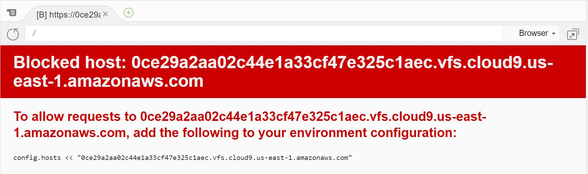
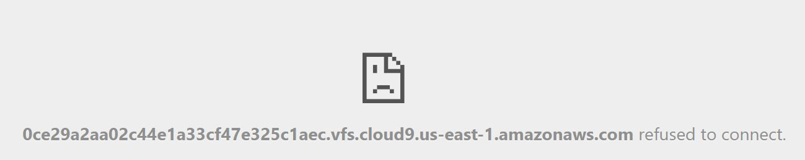
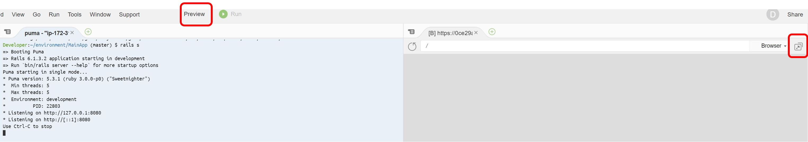
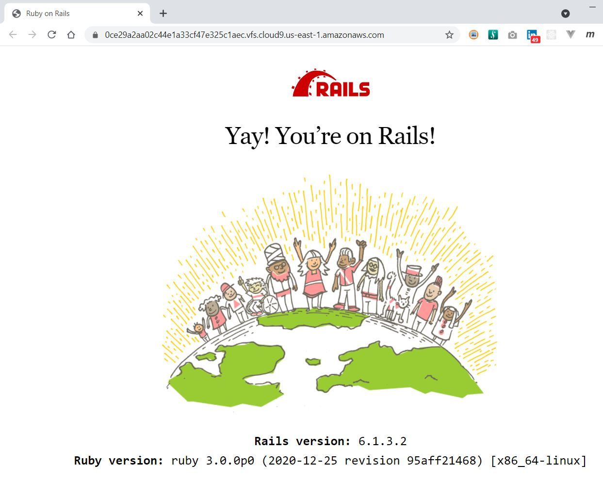

# How I developed this Ruby on Rails application #


## Get started ##


### Created a new Rails application ###
I created a new Rails application from the terminal.
```bash
cd environments
rails new MainApp -T --database=postgresql
```
I was using the `-T` flag to disable the default test framework since I will be using *RSpec*. I also used *Postgres* as the database instead of the defaul *SQLite*. Once the installation was complete, I changed into the new directory and started the Rails server.
```bash
cd MainApp/
Using /home/ubuntu/.rvm/gems/ruby-3.0.0
rails s
=> Booting Puma
=> Rails 6.1.3.2 application starting in development 
=> Run `bin/rails server --help` for more startup options
Puma starting in single mode...
* Puma version: 5.3.1 (ruby 3.0.0-p0) ("Sweetnighter")
*  Min threads: 5
*  Max threads: 5
*  Environment: development
*          PID: 21502
* Listening on http://127.0.0.1:8080
* Listening on http://[::1]:8080
Use Ctrl-C to stop
```

#### Grant Cloud9 access to the environment ####
I clicked on __Preview >> Preview Running Application__ to see the application which gave me an error.


I added the configuration to the development environment.
```bash
gedit config/environments/development.rb
```
I then restarted the Rails server and clicked on __Preview >> Preview Running Application__ again, this time it gave me the next error.
> __ActiveRecord::NoDatabaseError__: *FATAL: database "MainApp_development" does not exist*.


#### Configured the database ####
I updated the __/config/db/database.yml__ file and set __username__: *ubuntu* for both the *Development* and *Test* environments and migrated the databases.
```bash
rails db:create db:migrate
Created database 'MainApp_development'
Created database 'MainApp_test'
```

I restarted the Rails server and clicked on __Preview >> Preview Running Application__ again, this time it gave me the next error.


I clicked on the icon next to the browser to show the app in a separate browser tab.


This time it worked as expected and I could see Rails start page.



#### Set up version control ####
I initialised a *Git* repository.
```bash
git add .
git commit -m "Initial commit - Created MyApp"
```


#### Configured the IDE to connect to the repository ####
From __GitHub__ I selected __Code__ and copied the code from __…or push an existing repository from the command line__
```bash
git remote add origin git@github.com:BergstromDomain/MyApp.git
git branch -M main
git push -u origin main
Warning: Permanently added the RSA host key for IP address '140.82.114.3' to the list of known hosts.
Counting objects: 100, done.
Delta compression using up to 2 threads.
Compressing objects: 100% (85/85), done.
Writing objects: 100% (100/100), 141.14 KiB | 4.87 MiB/s, done.
Total 100 (delta 3), reused 0 (delta 0)
remote: Resolving deltas: 100% (3/3), done.
To github.com:BergstromDomain/MyApp.git
 * [new branch]      main -> main
Branch 'main' set up to track remote branch 'main' from 'origin'.
```


#### Added RSpec and Capybara ####
I update the __/Gemfile__ to include the new gems.
```ruby
group :development, :test do
  gem 'rspec-rails', '~> 5.0', '>= 5.0.1'
end

group :test do
  gem 'capybara', '~> 3.35', '>= 3.35.3'
end
```

I ran the installer to get the system ready.
```bash
bundle install
rails generate rspec:install
bundle binstubs rspec-core
```


#### Configured the IDE to connect to the repository ####
Committed my changes and pushed them to the remote repository.
```bash
git add - A
git commit -m "Added RSpec and Capybara"
git push origin main
```

----------
[<< Previous chapter](./1_1_set_up_development_environment.md) | [Table of contents](../how_i_developed_this_rails_application.md) | Next chapter >>
